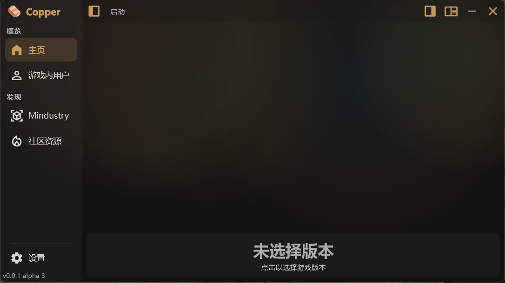

| 支持语言 | Support Language  |
|:--:|:--:|
| [中文](README.md) | [English](.readme/README-en.md) |

<p align="center">
  
</p>

# Copper Launcher

基于 **Flutter** 开发的多平台 [Mindustry](https://github.com/Anuken/Mindustry) 游戏启动器

> **目前处于开发阶段**：功能与界面仍在快速迭代，尚未发布正式版本。

<p align="center">
  
</p>

## 目录

- [Copper Launcher](#copper-launcher)
  - [目录](#目录)
  - [运行平台](#运行平台)
  - [功能](#功能)
    - [版本管理](#版本管理)
    - [启动游戏](#启动游戏)
    - [模组管理](#模组管理)
    - [网络与下载](#网络与下载)
    - [界面](#界面)
  - [从源码构建](#从源码构建)
  - [鸣谢](#鸣谢)

## 运行平台

| 平台 | 支持情况 |
|:--|:--|
| **Windows / Linux / macOS** | 完整支持，可使用启动器全部功能 |
| **Android** | 需安装 **CopperModLoader** 才能正常使用 |
| **iOS** | 不支持。平台限制较多，且无法运行 Java 模组，没有开发必要 |

## 功能

### 版本管理

- 同时管理多个游戏版本，版本之间可以**隔离存档**
- 版本列表取自官方 GitHub 仓库，并内置快照，网络异常时仍能浏览历史版本
- 按**时代分段**（正式版 / Classic / 远古版），并标注各时代的能力差异（如是否支持模组）
- 支持下载指定 build，以及预览版（BE）
- 导入 / 导出资源（存档、地图、模组、蓝图），导入功能仍在完善中
- 查看并导出游戏崩溃日志
- 记录每个版本的游玩时长与最近启动时间
- 生成启动脚本（`.bat` / `.sh`），可脱离启动器直接启动游戏

### 启动游戏

- 启动前配置 JVM 参数，并可**自动分配堆内存**（结合可用内存与已启用模组体积估算）
- 管理多个 Java 运行环境，缺失时可从 Adoptium 自动下载；按游戏版本自动挑选兼容的 Java（老版本用 Java 8 最稳）
- 覆盖游戏内设置与多人游戏用户名
- 启动后可将启动器收进**系统托盘**，游戏退出后自动弹回（桌面端）
- 单实例运行，重复启动会唤回已有窗口

### 模组管理

- 浏览并下载模组：列表取自官方 MindustryMods 仓库，支持 jar / zip 下载；非 Java 模组可直接取源码并自动命名
- 启用 / 禁用模组：同时改写游戏设置与文件后缀，官方加载器不会误扫到已禁用的模组
- 批量管理：多选、拖动连续选择、搜索与分类筛选
- 桌面端支持拖入文件一键导入
- 对 **CopperModLoader** 提供专门支持

### 网络与下载

- 统一网络层：自动 UA、GitHub API Token 注入、分块多线程下载与断点续传、下载限速
- **GitHub 镜像加速**：官方直连优先，网络异常时自动回退镜像；支持节点测速与自定义节点
- 代理三模式：跟随系统 / 自定义 / 关闭

### 界面

- 自研 UI 风格（不完全跟随 Material 3），自带按压回弹、浮层、下拉选择、滑动菜单等组件体系
- 多套主题色，支持深色 / 浅色 / 跟随系统
- 后台任务抽屉：下载与解压进度、任务日志集中查看

~~以及极其好看的 UI 界面与动效~~

## 从源码构建

需要 **Flutter**（Dart SDK `^3.11.5`）。桌面端目标只能在对应宿主系统上构建。

```bash
flutter pub get
flutter run -d windows     # 开发运行（换成 -d linux / -d macos）
flutter test               # 测试
flutter analyze            # 静态检查，目标 0 error
```

发布构建与打包用 `tool/build_release.dart`，可交互式运行，也可直接传参：

```bash
dart tool/build_release.dart --version 0.0.2 --channel alpha --bump --platform windows,android --package both
```

- 构建目标可多选：`windows` / `android` / `linux` / `macos`；交互提问只列出当前宿主能构建的目标，命令行选了不匹配的会被跳过并提示
- 打包格式随平台：Windows 出 Zip / Setup，Linux 出 tar.gz，macOS 出 dmg；产物落在 `build/dist/`

部分数据不随启动器更新（版本列表快照、GitHub 镜像节点、各版本设置适配表等），放在本仓库 `remote/` 目录，启动时拉取覆盖内置副本。

## 鸣谢

该项目主要参考了第三方 Minecraft 启动器的设计：

1. **PCL2**：UI 设计与页面逻辑
2. **LauncherX**：后台任务系统
3. **HMCL**：部分后端逻辑
